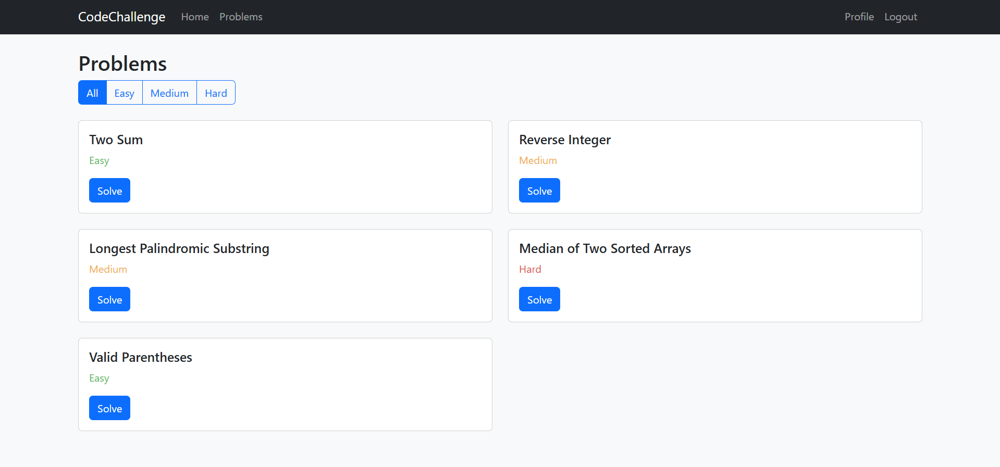
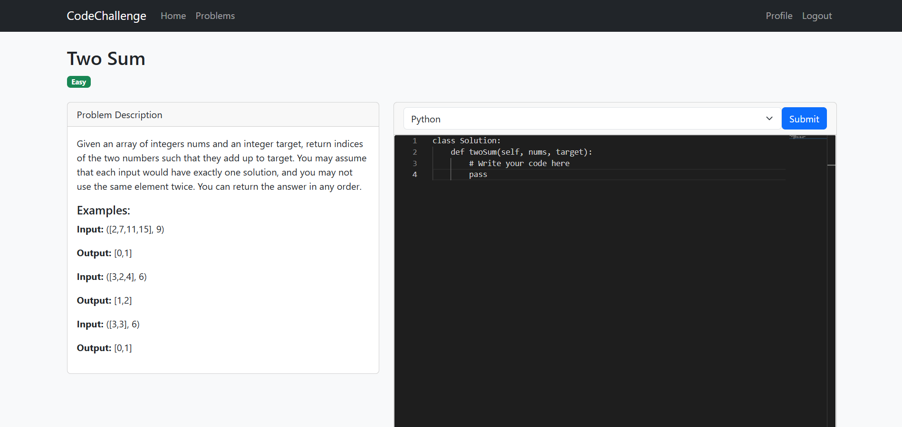
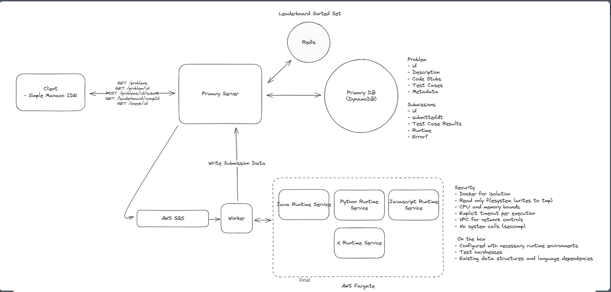
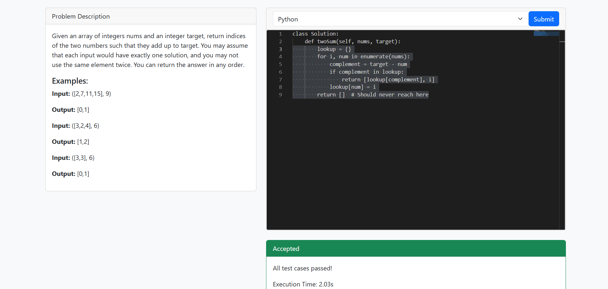

# LeetCode-Style Coding Platform



A robust, containerized coding platform that allows users to solve algorithmic problems in multiple programming languages, similar to LeetCode. This platform features a secure code execution environment, real-time feedback, and support for Python, JavaScript, Java, and C++.

## 🚀 Features

- **Multi-language Support**: Solve problems in Python, JavaScript, Java, and C++
- **Secure Execution**: All code runs in isolated Docker containers
- **Real-time Feedback**: Immediate results for your solutions
- **LeetCode-Style Problems**: Practice with familiar problem formats
- **Performance Metrics**: Track execution time and memory usage



## 🏗️ Architecture

The application consists of several key components:

1. **Frontend**: User interface for coding and viewing problems
2. **Backend API**: Manages problems, user submissions, and authentication
3. **Code Executor**: Securely runs user code against test cases
4. **Database**: Stores problems, test cases, and user submissions



### Code Execution Flow

1. User submits a solution to a problem
2. Backend validates the submission and sends it to the queue and then code executor
3. Code executor creates an isolated Docker container
4. User code is combined with a language-specific template
5. Code is executed against test cases
6. Results are captured and returned to the user

## 🛠️ Setup and Installation

### Prerequisites

- Docker and Docker Compose
- Node.js (for frontend)
- MongoDB

### Installation Steps

1. Clone the repository:
   ```bash
   git clone https://github.com/AlirezaMirrashid/SystemDesign.git
   cd Leetcode
   ```

2. Set up environment variables:
   ```bash
   # Edit .env with your configuration
   ```

3. Build and start the services:
   ```bash
   docker-compose up -d
   ```


4. Access the application at `http://localhost:3000`

## 💻 Usage

### Solving Problems

1. Browse available problems on the home page
2. Select a problem to view its description
3. Write your solution in the code editor
4. Choose your preferred programming language
5. Click "Submit" to run your code against test cases
6. View results and optimize your solution



### Example Solution (Python)

```python
class Solution:
    def twoSum(self, nums: List[int], target: int) -> List[int]:
        seen = {}
        for i, num in enumerate(nums):
            complement = target - num
            if complement in seen:
                return [seen[complement], i]
            seen[num] = i
        return []
```

## 🧩 How It Works

### Code Executor

The code executor is the heart of the platform. It:

1. Takes user code and test cases as input
2. Creates a temporary directory for each execution
3. Combines user code with language-specific templates
4. Runs the code in isolated Docker containers
5. Captures output and compares with expected results
6. Returns detailed feedback to the user

The executor supports different input formats and handles various edge cases to provide a robust coding experience.

### Security Measures

- All code runs in isolated Docker containers
- Resource limits prevent excessive CPU or memory usage
- Network access is disabled in execution containers
- Execution timeouts prevent infinite loops

## 📚 References

This project was inspired by and built with reference to:

- [HelloInterview's LeetCode System Design](https://www.hellointerview.com/learn/system-design/problem-breakdowns/leetcode)
- [LeetCode](https://leetcode.com/)
- [Docker Documentation](https://docs.docker.com/)
- [Flask Documentation](https://flask.palletsprojects.com/)

## 🤝 Contributing

Contributions are welcome! Please feel free to submit a Pull Request.

## 📄 License

This project is licensed under the MIT License - see the LICENSE file for details.

## 📧 Contact

Alireza Mirrashid - [alireza.mirrashid@gmail.com](mailto:alireza.mirrashid@gmail.com)
